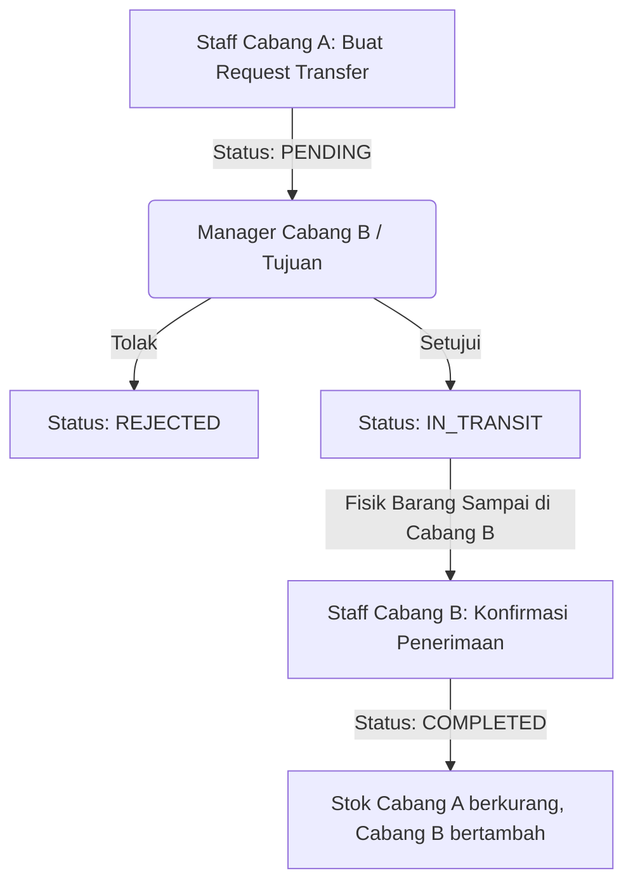

# Product Requirements Document (PRD)
## Proyek: Mini ERP - Manajemen Inventaris Multi-Cabang

### 1. Ringkasan Eksekutif
Sistem ERP skala kecil yang bertujuan untuk melacak dan mengelola stok barang (inventaris) secara *real-time* di berbagai cabang/gudang. Sistem ini didesain untuk perusahaan retail atau distributor yang memiliki lebih dari satu lokasi penyimpanan guna menghindari selisih stok dan mempercepat proses distribusi barang.

### 2. Tujuan & Nilai Bisnis
- **Akurasi Data Tinggi:** Menghindari *overselling* atau selisih stok akibat pencatatan manual yang lambat.
- **Transparansi Mutasi:** Memberikan jejak audit (*audit trail*) komprehensif untuk setiap perubahan stok guna mencegah kehilangan barang (fraud).
- **Efisiensi Logistik:** Menyediakan sistem transfer barang antar-cabang yang terstruktur untuk kelancaran rantai pasok.

---

### 3. Matriks Peran & Hak Akses (RBAC)

| Fitur | Super Admin | Manager Cabang | Staff Gudang |
| :--- | :---: | :---: | :---: |
| **Melihat Data Semua Cabang** |  Ya | Tidak (Hanya Cabangnya) | Tidak (Hanya Cabangnya) |
| **Kelola Master Produk (SKU/Harga)**| Ya | Tidak | Tidak |
| **Buat Cabang / User Baru** | Ya | Tidak | Tidak |
| **Input Stok Masuk (Stock In)** | Ya | Ya (Cabang Sendiri) | Ya (Cabang Sendiri) |
| **Input Stok Keluar (Stock Out)** | Ya | Ya (Cabang Sendiri) | Ya (Cabang Sendiri) |
| **Request Stock Transfer** | Ya | Ya (Cabang Sendiri) | Ya (Cabang Sendiri) |
| **Approve/Reject Transfer** | Ya | Ya (Jika Cabang Tujuan) | Tidak |

---

### 4. Alur Kerja Detil (Workflows)

#### A. Alur Kerja Transfer Stok Antar Cabang
Pemindahan barang antar-cabang tidak terjadi secara instan, melainkan melalui proses pengiriman dan penerimaan fisik barang.

1. **PENDING:** Cabang Asal membuat permintaan transfer produk & jumlah tertentu ke Cabang Tujuan. Stok di Cabang Asal langsung *dikunci* (reserved) agar tidak bisa dijual/digunakan untuk transaksi lain.
2. **REJECTED:** Cabang Tujuan menolak transfer. Stok yang dikunci di Cabang Asal dikembalikan (released).
3. **IN_TRANSIT:** Cabang Tujuan menyetujui. Barang mulai dikirim secara fisik.
4. **COMPLETED:** Cabang Tujuan mengonfirmasi barang telah sampai dan jumlahnya sesuai. Stok di database Cabang Asal dikurangi secara permanen, dan stok Cabang Tujuan bertambah.

---

### 5. Kebutuhan UI/UX (Layout Halaman)

* **Dashboard Utama:**
  * Metrik Ringkasan: Total nilai aset (Rupiah), jumlah SKU aktif, total transaksi mutasi bulan ini.
  * Widget: Peringatan stok menipis (*low stock alert*) berdasarkan limit minimum yang ditentukan.
  * Grafik: Tren mutasi barang teraktif.
* **Halaman Inventaris Cabang (Tabel Dinamis):**
  * Kolom: SKU, Nama Produk, Kategori, Harga, Stok Tersedia, Stok Terkunci (Reserved), Lokasi Cabang.
  * Fitur: Pencarian cepat, filter berdasarkan kategori dan cabang.
* **Halaman Form Mutasi:**
  * Pilihan Tipe Mutasi: In (Pembelian), Out (Penjualan/Kerusakan), Transfer.
  * Form pemilihan produk secara dinamis (multiselect/multi-item) dan kuantitasnya.

---

### 6. Penanganan Kasus Khusus (Edge Cases)

* **Ketidaksesuaian Barang Saat Diterima (Discrepancy):**
  * *Kasus:* Cabang A mengirim 10 pcs, tetapi saat sampai di Cabang B hanya ada 8 pcs karena 2 pcs rusak di jalan.
  * *Solusi:* Saat konfirmasi penerimaan (`COMPLETED`), Staff Cabang B memasukkan jumlah yang diterima secara aktual (8 pcs). Sistem akan secara otomatis mencatat selisih (2 pcs) ke log khusus dengan tipe `DAMAGED_IN_TRANSIT` untuk pelacakan keuangan.
* **Koneksi Terputus Saat Submit:**
  * *Solusi:* Frontend mengimplementasikan *loading state* (tombol dinonaktifkan setelah sekali klik) dan ID Transaksi unik berbasis UUID yang digenerate di sisi klien guna mencegah double-submit dari sisi pengguna.
